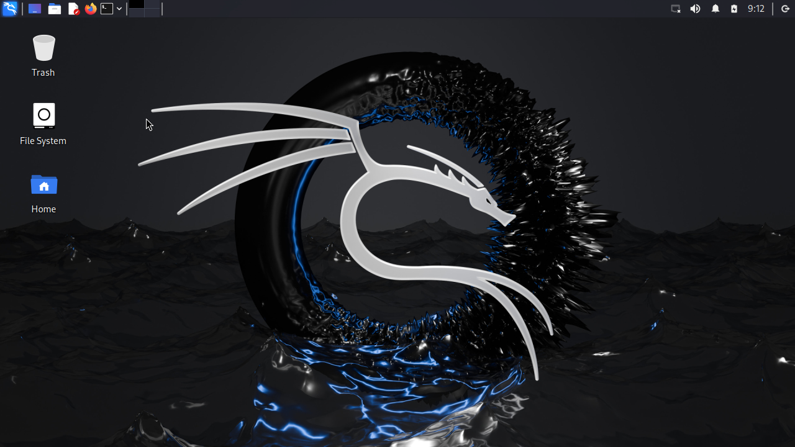

# KaliLinux desktop in termux

#Features:

 🌐2 browsers Firefox and chromium
 
 🎨gimp and inkscape used  to graphic design
 
 🎵vlc player   
 
 🔊 sound work
 
# installion

- `pkg update -y && pkg upgrade -y`
   - `pkg install git wget -y`
   - `git clone https://github.com/aymensecurity/kali-in-termux.git`
   - `cd kali-in-termux`
   - `mv * $HOME`
   - `cd $HOME`
   - `bash install-kali.sh`
   - `./start-kali.sh`
   - `bash gui.sh`
   - then select **XFCE**, **LXDE**, **LXQT**, choose Desktop 
